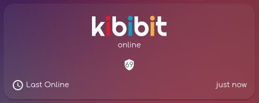
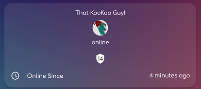
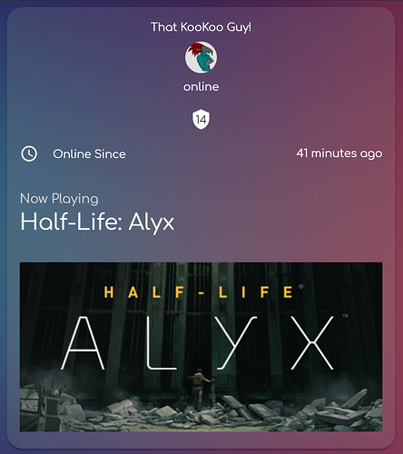
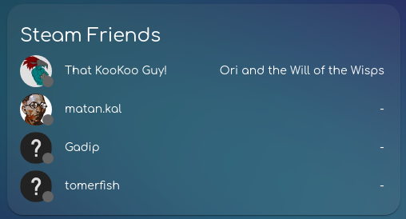
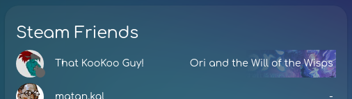

<p align="center">
  <a href="https://github.com/Kibibit/kb-steam-card/" target="blank">
  </a>
  <h2 align="center">
    @kibibit/hass-kibibit-theme
  </h2>
</p>
<p align="center">
  <a href="https://github.com/custom-components/hacs"></a>
  <a href="https://imgur.com/gallery/SQJNbWb"></a>
</p>
<p align="center">
  A Home Assistant card for Steam integrations
</p>
<hr>

([Theme](https://github.com/kibibit/hass-kibibit-theme) used in screenshots)

## Screenshots

### away \ offline state


### online state



### while playing a game



## Installation

### Prerequisites

You need at least one [steam integration]() to use with this card.

### HACS (recommended)

1. Go to the Community Store.
2. Search for `steam card`.
3. Press `Install`.

### Manual Installation

```yaml
resources:
  url: '<url-to-card.js>'
  type: module
```

## Usage

for a single user card, use `entity`:

```yaml
entity: sensor.steam_<steam-id>
type: 'custom:kb-steam-card'
```

you can change the username using the following:

```yaml
entity: sensor.steam_<steam-id>
friendly_name: Myself
type: 'custom:kb-steam-card'
```

for multiple users, use the `entities` attribute:


```yaml
entities:
  - sensor.steam_<steam-id>
  - sensor.steam_<steam-id>
  - sensor.steam_<steam-id>
type: 'custom:kb-steam-card'
```

you can also show the game header image as background with `game_background: true`:


```yaml
entities:
  - sensor.steam_<steam-id>
  - sensor.steam_<steam-id>
  - sensor.steam_<steam-id>
friendly_name: hello
game_background: true
type: 'custom:kb-steam-card'
```

## Stay in touch

- Author - [Neil Kalman](https://github.com/thatkookooguy)
- Website - [https://github.com/kibibit](https://github.com/kibibit)
- StackOverflow - [thatkookooguy](https://stackoverflow.com/users/1788884/thatkookooguy)
- Twitter - [@thatkookooguy](https://twitter.com/thatkookooguy)
- Twitter - [@kibibit_opensrc](https://twitter.com/kibibit_opensrc)

## Support

Hey dude! Help me out for a couple of :beers: or a :coffee: by clicking on the sponsering link!
